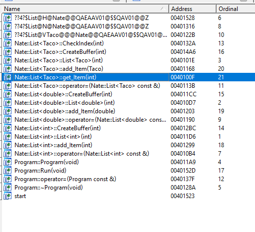
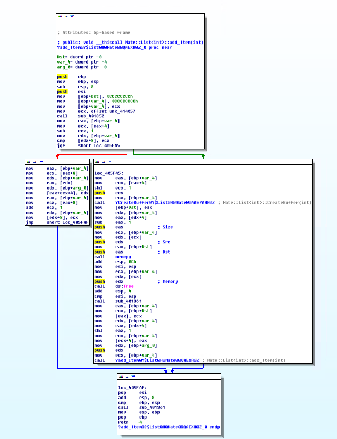
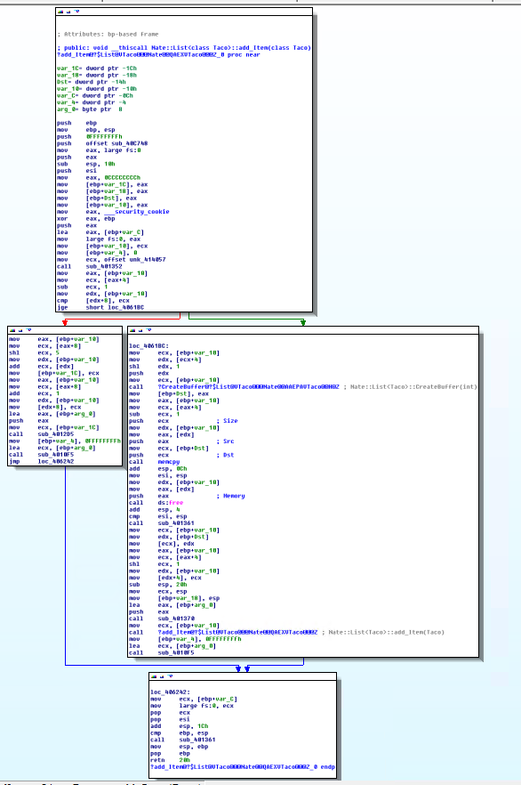

# C++ Template Notes

The two primary methods for code generation within C++ code are:

- Macros: Executed in PreProcessor
- Templates: Executed during Compilation

Macros are capable of doing simple string manipulations within a source, while templates generate actual code in the binary.

Since templates are real code they are natively part of the type system and enjoy the same debugging benefits as any other code in the project.

## How is a macro defined?

The hello world of macros tends to be:

```c
#define min(x, y) ( (x < y ? x : y) )
```

The advantage of macros is that they are very simple and solve the issue of `redundant code patterns`.

For example the Microsoft Configuration Manager code write every method as: 

```c
BEGIN_METHOD;
    CHECKHR( expr, 'The blah has failed');
END_METHOD;
```

These three macros would then expand and ensure all validation, start and end of methods was identicial across the many million lines of code.

## What does a templated class look like?

Due to a weirdness in C++'s compilation model, you cannot separate out .h and .cpp files very cleanly for template classes. Specifically, any translation unit (C++ source file) that wants to use a template class has to have access to the entire template definition. This is a strange quirk of the language, but unfortunately it's here to stay.

One option is to put the implementation up in the header file rather than in the source, then to not have a .cpp file at all.

Source: [linker-error-when-using-a-template-class](https://stackoverflow.com/questions/9171494/linker-error-when-using-a-template-class)

```c++
/// <author>
/// Nate Bachmeier - 2019.03.21
/// </author>
#pragma once
#include <stdio.h>
#include <memory.h>
#include <stdexcept>

namespace Nate
{
	template <class T>
	class List {
	private:
		T* items;
		int capacity;
		int end;

		void CheckIndex(int index);
		T* CreateBuffer(int size);

	public:
		List(int capacity);
		List();

		T get_Item(int index);

		void add_Item(T item);
	};

	template <class T>
	List<T>::List()
	{
		int capacity = 10;

		// Initialize the items[]
		this->items = this->CreateBuffer(capacity);
		this->capacity = capacity;
		this->end = 0;
	}

	template <class T>
	List<T>::List(int capacity)
	{
		if (capacity < 0)
		{
			throw new out_of_range("capacity must be positive");
		}

		if (capacity < 10)
		{
			capacity = 10;
		}

		// Initialize the items[]
		this->items = this->CreateBuffer(capacity);
		this->capacity = capacity;
		this->end = 0;
	}


	template <class T>
	void List<T>::CheckIndex(int index)
	{
		if (index < 0 || index > capacity - 1)
		{
			throw new out_of_range("invalid index");
		}
	}

	template <class T>
	T* List<T>::CreateBuffer(int size)
	{
		// Initialize the items[]
		T* buffer = new T[size];

		if (buffer == 0)
		{
			throw new runtime_error("out of memory");
		}

		return buffer;
	}

	template <class T>
	T List<T>::get_Item(int index)
	{
		this->CheckIndex(index);
		return this->items[index];
	}

	template <class T>
	void List<T>::add_Item(T item)
	{
		if (this->end < this->capacity - 1)
		{
			this->items[this->end++] = item;
			return;
		}

		T* newItems = this->CreateBuffer(this->capacity * 2);
		memcpy(newItems, this->items, this->capacity - 1);
		free(this->items);

		this->items = newItems;
		this->capacity *= 2;

		this->add_Item(item);
	}
};
```

## How Do I Reference this class?

The code can be called used as:

```c++
#include <stdio.h>
#include "taco.h"
#include "list.h"
#include "Program.h"

using namespace Nate;
void Program::Run()
{
	printf("Start App...\n");
	List<Taco> list(10);

	for (int i = 0; i < 100; i++)
	{
		Taco t;
		t.set_quantity(i + 1);
		list.add_Item(t);

		Taco q = list.get_Item(i);
		printf("Taco %d\n", q.get_quantity());
	}
}
```

## How Do Templates Work Under the Hood?

To inspect the binary IDA Pro Advanced Edition v6.1 was used to inspect the output.

1. Find output file `Debug\CppRefresher.exe`
2. Open with idaq

At first finding the methods within IDA was a pain, so the code was recompiled to export all the relevant bits.

```c
#pragma once
class __declspec(dllexport) Program
{
public:
	Program();
	~Program();

	void Run();
};
```

## How Do Templates Impact the size of the binary?

From the IDA disassembly it is clear that at compilation entirely separate classes have been generated. This increases the code size but will gain the benefit of static typing. 

One interesting observation is that only the functions touched are code generated, even on debug build. This would suggest that a template class could contain 100 methods, but the compiler is smart enough to only emit the 3 or 4 used.



### What was generated for List<T>.add_Item() ?

Even when the code is virtually identical the compiler does not appear to make any optimizations of reusing chunks. For instance `type(T)` could have been translated into an `void*` and broken into chunks:

1. typed parameter guard: Ensure the cast is valid.
2. untyped execution code

This is a screen shot of `List<int>.add_Item()`:



This is a screen shot of `List<Taco>.add_Item()`:


