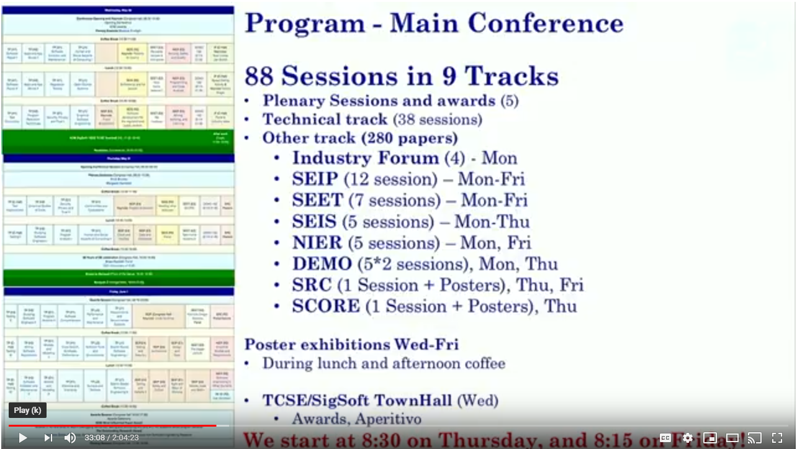
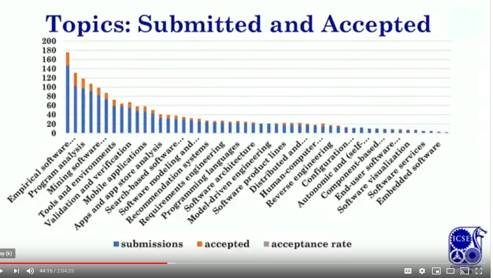

# What is ICSE ?

The [International Conference on Software Engineering](http://www.icse-conferences.org/) focuses on software engineering trends.

## What are the tracks for the 2018 Keynote ?

- The [2018 Keynote](https://www.youtube.com/watch?v=cpeMmMh7Syk) is available on Youtube.

## What was the distribution of papers ?

There were 105 papers accepted from 30 countries (21% acceptance rate)

## What were the key take aways of the keynote ?

Magnus Frodigh is the chief research for Ericsson. He described how different business verticales will be shaped through 5G wireless.

There were some interesting ideas on the need of edge computing and how that will bleed into cloud. 

One of the examples was a robot which balanced itself by using telemetry sent to a remote service.

As they slowly increased the latency the robot began to wobble drunkenly and eventually tipped over.

This showed the neccessity of industrial machines to have instaneous response times for accuracy and safety.
