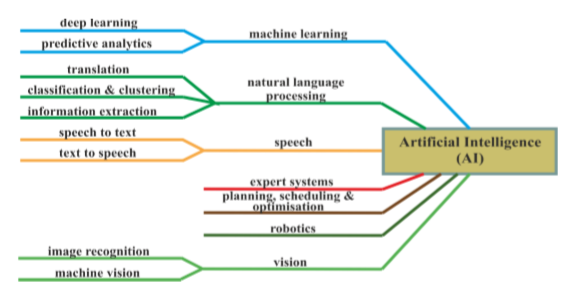

# AI Ethics Artifacts

This folder represents a cache of journals and other resources used during the investigation into this weeks [Assignment](../Assignment.md).

## AI - A New Field of Computer Science Which Any Business Should Consider

The [Economic Sciences Series](AI_NewField_BusinessView.pdf) provides a definition of AI and categorizes difference technology branches into a hierarchy.

There is also discussions around the phases of maturity in business adoption and the most frequent scenarios.

## Artifacts by Category

- [International Community](InternationalOpinion.md)
- [Medical Community](Medical.md)
- [Pyschology](Psychology.md)
- [Game Theory and Decision Processes](GameTheory.md)
- [Videos](Videos.md)