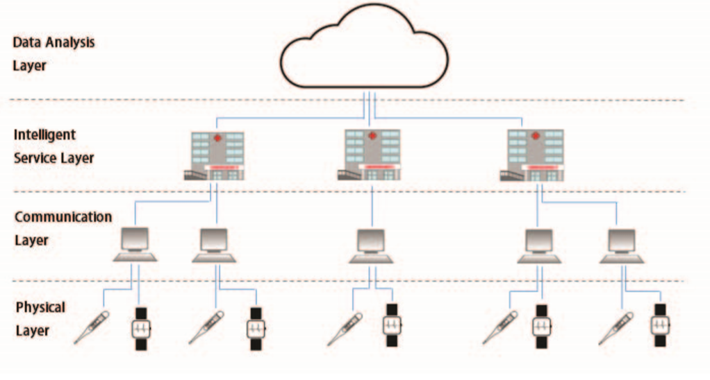

# Artifacts for eHealth Cloud Architecture

## General Cloud Design Principals

### Efficient Architecture Design for Software as a Service in Cloud Environments

The [article](SaaS_Design.pdf) focus on finding suitable architecture for current SaaS cloud solutions.

In the perspective of this architecture, it is not focused too much on performance, but especially on scalability, testability, abstraction, isolation, language independence, development cost reduction, effectiveness, and reusability.

### Transformation from Identity Stone Age to Digital Identity

The [article](IdentityEnhancement.pdf) describes the evolution of online identity into the modern "Identity as a Service" paradigm.

The author details the legacy universe of multiple forms of identification such as passwords and social security numbers, and the need to transition into OpenID based models. With an OpenID an identity can be provided along with a series of claims that are relevant to an "identity zone".

For example Bob has a certain persona with their friends but that same persona might not fit with their ebay account. There are clearly overlaps but different details will have no contextual meaning.

They go on to describe the need for federated identities as a means of maintaining shared identity between services. Contoso.com does not need to risk an insecure disclosure of credentials, if they rely on a third party such as Azure Activity Directory to the actual passwords storage.

Transitioning to a federated model has four phases:

1. Cross organizational trusts : Multiple domain controllers trust each other
2. Open id foundation (OIDF) : Tokens can be given to agree on shared identity
3. Hybrid Cloud trusts : Tokens can be issued for cross environments (disjoined SSO scenarios)
4. Open identity exchange (OIX) : Centralized identity, policy, and Level of Assurance (LoA)

### Tackling Cloud Security Issues and Forensics Model

Modern medical facilities need to archive enormous amounts of data in the form of:

- Hospital Information Systems
- Patient History Information

These data caches can easily grow into the petabyte sized due to the high resolution of medical imaging and similar lab results.

Aspects of these systems can be protected with classical encryption but consideration is needed handling reputiation scenarios.

The researchers discuss [the inclusion of forensic modeles](CloudForensicModels.pdf) as an extension of both traditional networking and cloud systems.

A lot of those discussions boil down to Authenticate, Authorize, Audit, and encrypt with trusted platform modules (TPM).

Understand the capabilities exposed by the cloud solution provider (eg. Amazon or Microsoft); and how they can be leveraged.

### A Survey on Cloud Security Issues and Techniques

The article enumerates [various challenges](CloudSecuritySurvey.pdf) that must be addressed with proper cloud based design.

They categorize cloud native solutions as being within levels:

- __SaaS__ : Software as a Service
- __PaaS__ : Platform as a Service
- __IaaS__ : Infrastructure as a Service

Different levels will have different strengths and weaknesses. Example: SaaS has a lower maintence overhead than IaaS, but will suffer risks of multi-tenant execution. If an attacker can compromise the hypervisor and gain access to the host, they can access anything that is running on that same physical machine.

Locality of execution can introduce both legal and operational challenges as major cloud providers are global. Storage and compute resources need to be provisioned into specific regions to address these challenges. Example: European data must stay in Europe.

Services within the cloud are also exposed to the Internet and must be addressed with proper firewalling and access control. The article made not mention of virtual private clouds or virtual private networks as attack surface reduction solutions.

Cloud Services must be designed to have Quality of Service (QoS) characteristics: Availability, Reliability, Latency, and Response Time.

### Internet cloud security: The illusion of inclusion

The [article](IllusionOfInclusion.pdf) describes cloud adoption challenges such as training and security concerns.

They make an argument that putting systems in the cloud does not magically make them more or less secure. Attack surface needs to be reduced through training and configuration. Organizations also need a business continuity / disaster recovery plan.

## Components and Implementation Considerations of eHealth Care

### EMR vs EHR - What is the Difference

According to [HealthIT](https://www.healthit.gov/buzz-blog/electronic-health-and-medical-records/emr-vs-ehr-difference) electronic medical records are digital copies of medical files. Electronic Health Records is a total picture of the patient.

To create an EMR system one needs encryption and storage. For an EHR one needs to leverage EMR data for analytical and alerting scenarios.

### eHealth is health care transformation, not an IT project

The article discusses [a different mindset needed to build eHealth](eHealthBenefits.pdf) systems. The author states that:

1. eHealth support must not be tackled as an “information technology or IT project” but as a means for improving health care service

2. the “solutions” must not be conceived as once and-for-all, but must follow a judicious cost-effective approach of adopting and adapting the technologies and related procedure.

Another challenge with eHealth is coming up with a availability for all patients not only pockets of users. He goes on to suggest that instead of dedicated infrastructure eHealth should be built on existing commodity services. For example use the Internet and tools like WhatsApp.

The author goes on to decribe "HealthNets" (health networks) -- as not needing to be overly ambishious in scope but extensible, so that features and integrations can be added over time. Get the tooling out there and people will use it. They make a comparison to WhatsApp which was simple and available allowing it to grow to 1.6 billion messages per day.

### Analysis and Typology of Global eHealth Platforms – A Survey on Five Continents

The [article](Global_eHealth.pdf) gives an overview of the empirical state of eHealth across the different continents, and attempts to losely categorize their maturity levels.

_Patient Workflow Support Systems_: South Africa and Pakistan have very simple but effective eHealth systems. Focuses on physically scheduling people and resources through the health care system.

_Basic EHR-like systems_: Belize uses a system that supports both patient workflow and national identity of centralized health records. They also included branch office replication to handle unreliable network connectivity. It doesnt do a lot but the little it does, it does well.

_Comprehensive, Complex Systems and Platforms_: Brazil and Estonia started simple and then added complexity in stages, this allowed them to get it right before adding more challenges. They upgraded in phases

- Patient Flow
- Data capture and billing
- Medication dispensing
- Referal and Counter Referal to Specalist

_National Framework Systems and Common Components_: Canada and Austraila use common integration requirements to connect many decentralized medical professionals into a larger shared system. The larger system focuses on the brokerage of information not so much on the storage of individual records. That is delegated to hospitals and insurance carriers.

Key Failures:

- Austriala's firt attempt was 128m over 4 year to identify the requirements of a national system. Insufficient committment resulted in no little follow through.
- Next their Personally Controlled eHealth Record system was given 467m -- but was poorly marketed resulting in under 700k users
- Canada Health Infoway Inc is a not for profit that has received 2.1b government funds -- they have invested in 380 different projects which are slowly converging

_International core Patient Data Exchange Servies_: Europe has attempted to create a record exchange that spans borders, languages, and even alphabets. The EC organized the kickoff from 2008-14 and has since delegated management to member nations.

### Centralized Healthcare Cyber-Physical System's Architecture Development

The [article](HealthCare_CyberPhysical.pdf) describes the need for bluring the edge between physical and cyber health care systems. Physical health care are sensors, monitors, and different tests. Cyber refers to the algorithms and analytics that enumerate that data and look for patterns.

Their argument is that by combining these worlds together it becomes easier to ask "the right questions, with the right data at the right time."

This requires the design of new protocols for machine to machine communication, which will come from the availability of large sensor networks. This ties back with the week 1 discussions of 5G wireless and its associated implications.

They state that it will require involvement from different professional groups before reaching a utopian outcome. At that stage, far into the future, autonomous surgerys could be the norm -- but would first require many rounds of:

- Model
- Design
- Analysis

They envision the architecture of this system will be four layers:

- Data Analysis
- Intelligent Services
- Communication
- Physical Layer

## Security, Privacy, and Reliability

### Block-based Access Control for Blockchain EMR

Researchers are looking at using Blockchain as a representation of the distributed nature of eHealth information.

One of the key challenges is that block chain natively supports data integrity not confidentiallity.

This problem is currently being addressed through the use of PKI services, which are costly and complex for smaller medical officies.

Another challenge is caused by the limited amount of computation on medical IoT devices.

The authors propose a [mechanim where symetric keys are used](BlockchainEMR.pdf) to authenticate to a EMR server, which then returns blocks encrypted with AES().

The clients then decrypt the block in the same manner as normal web traffic.

## International Implementations of eHealth

### eHealth in Denmark: A Case Study

Denmark is [widely seen as a leading country in terms of eHealth integration and healthcare delivery service](Denmark_eHealth.pdf). However it has not reached its full potential due to fragmentation. The fragmentation is caused by the EU having poor guidance which has led to different European nations doing things differently.

They describe eHealth components as:

- Electronic Medical Records (EMR)
- Electronic Health Records  (EHR)
- e-Perscriptions (e-RX)

Denmark declared in 2007 that health care is a basic human right, and that the state government must pay for it. The federal government only pays for chronic long term illnesses. This aligns with a decentralized model of decisions being made at federal, state, and manicipal levels. There are 5 regional states and 98 municipalities (pg 4).

Their model is patients start at general practitioners (GP) who recommend specialist. Since 2004 all GP are required to use 'MedCom' an electroic medical exchange system. MedCom handle collection, query, and notification of patient state changes. MedCom routes roughly 5m messages/month as of 2012.

Message exchange between offices takes place in EDIFACT (legacy) and moving toward Xml standards going forward (FNUXformat (Fælles Nordisk Udvekslingsformat i XML).

The article points out that Denmark is only 5.5 million residents which does simplify the management of the eHealth system. According to [enchantedlearning.com](https://www.enchantedlearning.com/usa/states/population.shtml) this is roughly the size of Colorado or Wisconson. This helps to reduce the scalability issues and promote consistency across a smaller population.

Key Failures along the way:

- G-EPJ: Attempted to unify all EMR systems, lacked unanomous support and was overly complex. Stepping stones along the way were required.
- National PatientIndex: EHR system that was significantly underfunded leading to delays and unrealistic timelines.

These challenges reduced the confidence in the govenerments ability to efficiently use resources, and added political baggage for future programs. Another challenge was distruption to the doctoral workflow as the direction changed which further added to political baggage and inefficiences.

### Exploring the feasibility of eHealth solutions to decrease delays in maternal healthcare in remote communities of Ghana

Ghana is a rual nation of 28 million in West Africa with typical household incomes of around 1000 USD/month. The nation has high quality health care and nationalized medical insurance-- but is also challenged with shortages of professionals and equipment.

They looking at [eHealth as a mechansism to address the unequalized access to medical information](Ghana_remote_location_ehealth.pdf), especially in remote areas of the nation.

To gain adoption in these rural areas the systems needed to first interview the inhabitants and find out their religous and ethical requirements. This was similar to the ethical AI discussions of last week -- where proper societal scopes need to be addressed. The effort also ties in with [eHealthBenefits](eHealthBenefits.pdf) article that states `eHealth != IT project`. These are deeply personal systems that need to adhere to those requirements.

Along with societal requirements there were technological challenges, the most obvious being network connectivity. For eHealth to succeed the article sites a need for:

- Content : A lack of standards and consistent procedures led to radically different experiences between locations
- Connectivity : Wired cables are unlikely to ever be laid, the system must be built for wirelss and mobile access
- Capcaity : The physical infrastructure and its ability to support the transfer of data
- Community : Low educational resources and strong community identities
- Context : The nation is hot, humid, povertity stricken; with limited access to food and electricity

Having these components provided a framework to begin studying why maternal deaths were so high, and the source of the delays before seeking medical attention.

### Modelling the utilization of cloud health information systems in the Iraqi public healthcare sector

The [Iraqi eHealthCare](Iraqi_Healthcare.pdf) sector has been suffering from health records management issues from the perspectives of low information technology integrity and data complexity. Their study proposed a model by defining the critical success factors influencing physicians confirmation and behavioral control toward utilizing cloud health information systems in Iraqi hospitals.

The authors found that healthcare professionals resistance was the result of regret avoidance, inertia, perceived value, switching costs, and perceived threat. In addition, the researchers found that attitude, subjective norm, and perceived behavior control affected professionals intention to use the health cloud.

In the Taiwanese hospital industry they found that the five most critical factors were data security, perceived technical competence, cost, top manager support, and complexity.

RQ1: What are the effects of system integrity factors in terms of compatibility, complexity, security, and privacy on physicians confirmation and behavioral control to utilize cloud computing services in the Iraqi healthcare sector?

### Barriers to using eHealth data for clinical performance feedback in Malawi: A case study

Sub-optimal performance of healthcare providers in low-income countries is a critical and persistent global problem. The use of electronic health information technology (eHealth) in these settings is creating large-scale opportunities to automate performance measurement and provision of feedback to individual healthcare providers, to support clinical learning and behavior change [article](Malawi_Barriers_to_ehealth.pdf).

**Summary points**
What was already known on this topic:

- Adoption of eHealth in low-income countries is creating large-scale opportunities to use data for clinical performance feedback.
- Data quality is a significant barrier to the secondary use of clinical data in low-resource settings.

What this study has added to our knowledge:

- Key barriers to using eHealth for individualized performance feedback in Malawi are provider rotations, disruptions to care processes, user acceptance of eHealth, and performance indicator lifespan.
- Technology designed for eHealth-based audit and feedback in low-resource settings could accommodate these barriers using routine data quality assessment.
- Understanding low-resource clinical settings as complex adaptive systems (CASs) may enable designers of technology to effectively model change processes for audit and feedback.

### A Literature Review of eHealth Sector and Challenges in Nigeria

The [article](NigeriaHealthcare.pdf) provides a summary of the challenges that prevent eHealth adoption within Nigeria. They realized from the literature
review that a full scale implementation which would consider organizational structure, technology platform, policy, legislation, social benefits and change management is required.

This is similar feedback to the [Iraqi eHealthCare](Iraqi_Healthcare.pdf) article which also cited (p135):

- Organizational Theory
- Diffusion of Innovation Theory
- Theory of Reasoned Action

eHealth adoption is not quite the same in most of the developing countries, such as Nigeria, Uganda, Zimbabwe, Rwanda, Namibia, India, Afghanistan, Malaysia, Libya, and so on: provision of good and affordable health care services have always been a problem due to numerous factors such as: poor, ICT infrastructure, lack of constant electricity, inadequate health policies and lack of qualified personnel.

Their health care eHealth system is also showing signs of wear and tear as the country has not spent enough on repairs. This can be seen as an example of why maintenance costs need to be included in the total cost of ownership of cloud based systems.

### eHealth in Saudi Arabia: Current Trends, Challenges and Recommendations

This [study](SaudiArabia_eHealthTrends.pdf) is to explore the current status of eHealth in Saudi Arabia from the perspective of health informatics professionals.

1. what is the current status of eHealth in Saudi Arabia in terms of implementation and progress, from the
perspective of health informatics professionals

2. what are the different types of challenges facing eHealth in Saudi Arabia

3. what are the existing trends and recommendations that will enhance eHealth efforts and outcomes in Saudi Arabia.

Cultural, bureaucratic, and human resource issues are some of the main barriers to eHealth implementation in Saudi Arabia.

## Applications within eHealth

### Medshare: A Novel Hybrid Cloud for Medical Resource Sharing Among Autonomous Healthcare Providers

Legacy electronic health record systems were not developed with the level of connectivity expected from them nowadays. Therefore, interoperability weakness inherent in the legacy systems can result in poor patient care and waste of financial resources. Simultaneously, healthcare providers are not yet ready to dispose of them. Large hospitals are also less likely to share their data with external care providers due to economic and political reasons [article](MedShare_HybridCloud.pdf).

The proposed system architecture and its implementation is based upon:

1. custom data extractors to extract legacy medical data from the three hemodialysis centers under consideration

2. negotiated and converted to a common data model in each of the private cloud of a provider

3. indexed patient information using the HashMap technique into the public cloud that operates on private clouds, called a hybrid cloud

4. a set of services and tools installed as a coherent environment to exchange information smoothly.

### Mobile Cloud Computing For Emergency Healthcare Model:Framework

The [article](MobileCloud_for_Emergencies.pdf) describes a mobile application for getting emergency assistance or scheduling medical appointments.

Their implementation uses a centralized database in the cloud and then a mobile notification system.

### An integrated holistic model for an eHealth system: A national implementation approach and a new cloud-based security model